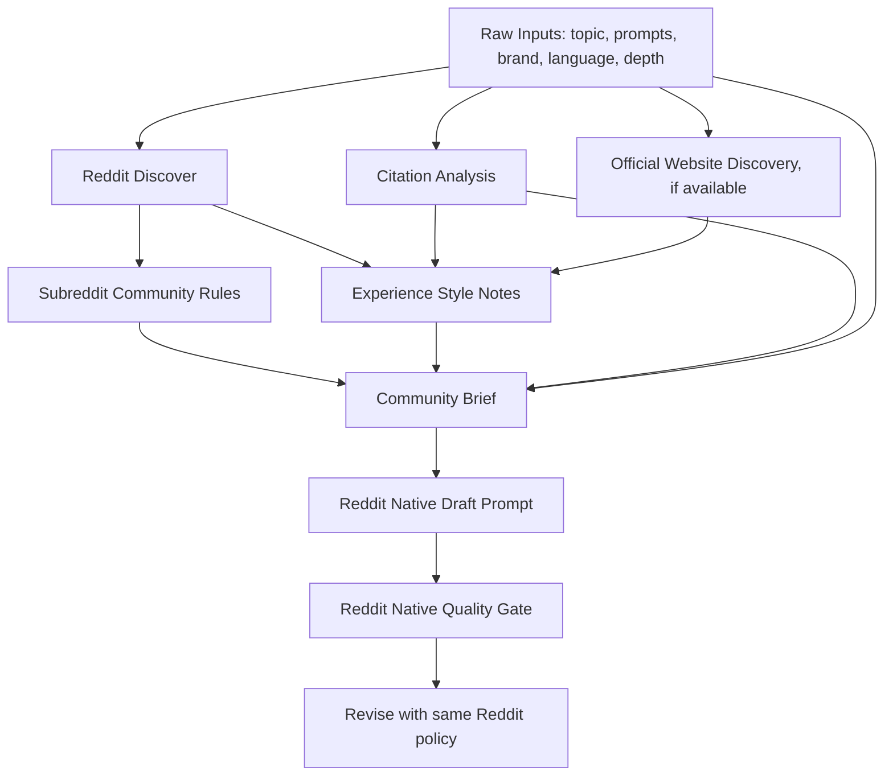

# Reddit Native Content Generation Redesign

## Status

Implemented with follow-up hardening.

Follow-up hardening closes the gaps found after the first implementation:

- Derived Prompt Artifacts are no longer a renamed wrapper around raw Strategy / Citation / Discover payloads.
- Reddit templates use an artifact preparation stage that produces schema-bound artifacts before final drafting.
- Reddit template data owns artifact fields, voice rules, community rules, data disclosure policy, and Quality Gate rules.
- Final Reddit prompts suppress raw internal artifacts and consume rendered `subreddit_community_rules`, `experience_style_notes`, and `community_brief`.
- Reddit final content does not require a public `Data Sources` section; provenance remains internal metadata/status.
- Quality Gate supports configurable opening, ending, dynamic brand mention, and standalone brand-section rules.

## Goal

Improve Reddit article generation so it reliably produces community-native posts instead of SEO/blog-style guides, while keeping Official Website and other content templates stable.

The redesign must be configuration-driven. Reddit-specific behavior must live in template data, not in hardcoded branches such as `if content_type == "reddit_article"` except for generic capability routing.

## Current Problem

Recent prompt debugging showed that the Reddit template rules are present and generally correct, but the upstream prompt context still pushes the model toward structured industry-guide writing.

The main causes are:

- Raw Strategy, Citation Analysis, RATF, and Discover outputs are injected too directly into the final generation prompt.
- RATF metric jobs are Reddit-safe, but global subgoal descriptions can still contain blog/article-oriented language such as table or FAQ patterns.
- Citation and Discover summaries are useful analysis artifacts, but their current shape reads like an internal strategy brief, not like Reddit writing material.
- When Product Facts are empty, the model falls back to industry summaries and search-grounded category writing, which weakens first-person workflow texture.
- Existing Quality Gate catches many violations after generation, but the upstream input still encourages the wrong shape.

The desired behavior is not merely "Reddit tone"; the whole Reddit prompt assembly should be Reddit-native.

## Non-Goals

- Do not rewrite the whole content pipeline.
- Do not break Official Website article generation.
- Do not change Visibility, Citation, Sentiment dashboards.
- Do not store Reddit-specific behavior in Python constants when it can be template configuration.
- Do not require users to manually provide first-hand notes as the primary fix.

## Key Architecture Decision

Keep the current main pipeline shape:

1. Citation Analysis
2. Strategy Generation
3. Content Generation
4. Quality Review
5. Revise

Add a generic template-driven layer inside the existing pipeline:

**Derived Prompt Artifacts**

This layer converts raw analysis outputs into final-prompt-ready artifacts according to the current template's `wizard_config`.

For Reddit templates, derived artifacts include:

- `subreddit_community_rules`
- `experience_style_notes`
- `community_brief`
- `reddit_native_writing_contract`

For non-Reddit templates, this layer is disabled by default and existing behavior remains unchanged.

## Configuration Location

All Reddit-specific behavior should be configured on the Reddit content template in:

`geo_report_templates.wizard_config`

It should not live inside individual Wizard Step definitions as the source of truth.

Reason:

- Wizard Steps define what the pipeline can compute.
- Template config defines how each template uses those computed artifacts.
- The same raw step output can be useful differently for Reddit and Official Website.

For example:

- Citation Analysis for Official Website can influence sections, FAQ, evaluation criteria, and verified resources.
- Citation Analysis for Reddit should become reader tensions, objections, workflow patterns, and things to avoid.

## Proposed Template Config Fields

### `prompt_input_policy`

Controls what raw artifacts are injected directly and what must be transformed.

Example:

```json
{
  "mode": "reddit_native",
  "raw_artifact_policy": {
    "strategy_generation": "summarize_to_community_brief",
    "citation_analysis": "summarize_to_reader_tensions",
    "reddit_discover": "summarize_to_community_rules",
    "official_discover": "derive_experience_style_notes",
    "ratf_framework": "render_template_native"
  },
  "hide_internal_frameworks": true,
  "forbidden_raw_sections": [
    "Strategy dimensions",
    "Citation Analysis Summary",
    "RATF subgoal raw descriptions",
    "Feature-to-Benefit Mapping",
    "Brand Fit Summary"
  ]
}
```

This config does not disable upstream analysis. It only prevents internal artifacts from being copied into the final Reddit prompt in their raw form.

### `ratf_rendering`

Controls RATF prompt rendering per template.

Example:

```json
{
  "mode": "template_native",
  "include_metric_jobs": true,
  "include_subgoal_raw_descriptions": false,
  "subgoal_overrides": {
    "information_presentation": "Use short paragraphs, lightweight bullets, concrete examples, and natural Reddit pacing. Do not use tables, matrices, or FAQ blocks."
  }
}
```

Official Website templates can keep current RATF behavior. Reddit templates use native rendering to avoid global subgoal wording conflicts.

### `reddit_native_contract`

Defines final writing constraints.

Example:

```json
{
  "opening_contract": {
    "required_shape": "first_person_workflow_or_testing_friction",
    "forbidden_openers": [
      "If you are trying to",
      "In 2026",
      "A question that comes up a lot",
      "The landscape is shifting"
    ]
  },
  "structure_contract": {
    "forbidden_headings": [
      "Phase 1",
      "Step-by-Step",
      "Checklist",
      "The Reality Check",
      "Where [Brand] Fits",
      "Helpful Resources",
      "FAQ"
    ],
    "preferred_heading_style": [
      "What I have tried so far",
      "Where it still falls apart",
      "The stack that feels less painful"
    ]
  },
  "voice_contract": {
    "preferred_patterns": [
      "I've been testing...",
      "What has worked better for me is...",
      "I still don't fully trust...",
      "The annoying part is..."
    ],
    "forbidden_patterns": [
      "consensus among creators",
      "brand-safe visual control",
      "platform-ready",
      "scroll-stopping",
      "high-volume creators",
      "industry-leading",
      "highly recommended"
    ]
  },
  "brand_mention_contract": {
    "max_mentions": 2,
    "must_be_inside_workflow_or_tool_stack": true,
    "forbid_standalone_brand_section": true,
    "example_allowed_shape": "I've had better luck using Dreamina for short product B-roll, then cleaning things up in CapCut."
  },
  "closing_contract": {
    "required_shape": "real_discussion_question",
    "forbidden_shape": "marketing_cta"
  }
}
```

### `experience_style_notes`

Defines how to generate writing-perspective scaffolding.

Example:

```json
{
  "enabled": true,
  "sources": [
    "reddit_discover",
    "official_discover",
    "citation_analysis"
  ],
  "fact_policy": "writing_perspective_only_not_factual_claims",
  "output_schema": {
    "persona_frame": "string",
    "workflow_texture": ["string"],
    "skeptical_phrases": ["string"],
    "allowed_experience_claims": ["string"],
    "forbidden_experience_claims": ["string"]
  }
}
```

This solves the Product Facts gap without requiring manual user input. The artifact can say "write from the perspective of someone testing AI video workflows", but it cannot claim the author actually tested Dreamina unless that fact exists in inputs.

### `community_brief`

Defines the final compressed artifact used by Reddit generation.

The Community Brief should contain exactly these sections:

1. `community_tension`
2. `reader_objections`
3. `workflow_angle`
4. `brand_safe_mention_angle`
5. `things_to_avoid`
6. `closing_discussion_question`

Example:

```json
{
  "enabled": true,
  "max_words": 500,
  "source_priority": [
    "subreddit_community_rules",
    "experience_style_notes",
    "reddit_discover",
    "citation_analysis",
    "selected_prompts"
  ],
  "output_schema": {
    "community_tension": "string",
    "reader_objections": ["string"],
    "workflow_angle": "string",
    "brand_safe_mention_angle": "string",
    "things_to_avoid": ["string"],
    "closing_discussion_question": "string"
  }
}
```

## Wizard Step Impact

### Main Engine

The main engine should gain one generic capability:

`derived_prompt_artifacts`

This can be implemented as:

- A new optional workflow step before content generation, or
- An internal sub-stage inside Strategy Generation / Content Generation.

Recommended design:

Add an optional generic step:

`prompt_artifact_preparation`

It runs only when `wizard_config.prompt_input_policy` or `wizard_config.derived_prompt_artifacts` enables it.

This is not a Reddit-specific step. It is a generic step that templates can use to transform raw artifacts.

### Existing Templates

Existing templates do not need to know about Reddit artifacts.

Default behavior:

```json
{
  "prompt_input_policy": {
    "mode": "legacy_raw"
  }
}
```

If a template does not configure `prompt_artifact_preparation`, the pipeline should preserve current prompt assembly behavior.

### Admin UI

Admin Template Editor already exposes advanced JSON fields. It should surface these new config blocks as editable Advanced Template Config fields:

- `prompt_input_policy`
- `ratf_rendering`
- `reddit_native_contract`
- `experience_style_notes`
- `community_brief`
- `derived_prompt_artifacts`

No template-specific UI is required for v1. JSON editor is acceptable.

## Proposed Reddit Runtime Flow



Raw artifacts remain stored for debugging and status display. The final Reddit generation prompt should not include raw Strategy blocks, raw Citation Summary, or raw RATF subgoal descriptions unless the template explicitly allows them.

## Quality Gate Changes

Reddit Quality Gate should add deterministic checks for:

- Forbidden headings:
  - `Phase 1`
  - `Step-by-Step`
  - `Checklist`
  - `The Reality Check`
  - `Where .* Fits`
  - `Helpful Resources`
  - `FAQ`
- Forbidden voice:
  - `consensus among creators`
  - `brand-safe visual control`
  - `platform-ready`
  - `scroll-stopping`
  - `high-volume creators`
  - `industry-leading`
  - `highly recommended`
- Opening shape:
  - First paragraph must contain first-person or concrete workflow/testing framing.
- Brand placement:
  - No standalone brand section.
  - Brand mention count must stay within configured range.
- Closing:
  - Must end with a discussion question, not a CTA.

These rules should live in `wizard_config.quality_gate.rules`, not code constants.

## Compatibility and Stability

### How Other Templates Stay Stable

- New behavior is opt-in through template config.
- Existing templates default to `legacy_raw` prompt assembly.
- New derived artifacts are additive outputs. They do not remove existing task outputs.
- Official Website templates continue using structured Strategy, Citation, RATF, and segmented generation.
- Quality Gate remains template-configured; Reddit rules are not applied globally.

### Code Boundary

Allowed generic code changes:

- Load new config blocks from `wizard_config`.
- Add a generic derived artifact runner.
- Add generic prompt assembly modes driven by config.
- Add generic RATF rendering options driven by config.
- Add deterministic quality-rule evaluators that read rules from config.

Disallowed code changes:

- Hardcode Reddit phrases in Python outside config defaults.
- Branch business behavior by a specific template ID.
- Apply Reddit quality rules to Official Website or other templates.
- Remove raw analysis outputs needed for audit/debug.

## Data Migration Strategy

Create a migration that updates Reddit templates only with:

- `prompt_input_policy`
- `ratf_rendering`
- `reddit_native_contract`
- `experience_style_notes`
- `community_brief`
- Additional `quality_gate.rules`

Official Website templates should not be changed except where a generic default is needed and behavior is unchanged.

## Testing Strategy

### Unit Tests

- Template without `prompt_input_policy` keeps legacy prompt assembly.
- Reddit template with `prompt_input_policy.mode = reddit_native` does not include raw Citation Summary in final draft prompt.
- Reddit RATF rendering excludes raw subgoal descriptions.
- Community Brief generation schema is valid.
- Experience Style Notes include `fact_policy` and do not convert writing perspective into factual claims.

### Integration Tests

Generate a Reddit prompt with mocked Reddit Discover, Citation Analysis, and Official Discovery. Assert:

- Final prompt contains Community Brief.
- Final prompt contains Experience Style Notes.
- Final prompt does not contain raw Strategy dimensions.
- Final prompt does not contain raw RATF subgoal descriptions.
- Final prompt does not contain `Brand Fit Summary`, `Helpful Resources`, `FAQ`, or `Phase 1`.

### E2E Checks

Run the same three-task scenario:

- Dreamina Reddit
- Dreamina Official Website
- AnswerX Official Website

Expected:

- Reddit output reads like a peer workflow post.
- Official Website outputs remain structured and high-quality.
- Admin progress/status still shows raw analysis steps and derived artifact steps clearly.

## Success Criteria

Reddit output should satisfy:

- Title reads like a real Reddit question or workflow tension.
- Opening paragraph starts from personal testing/workflow/friction, not category overview.
- No table, matrix, FAQ, resources, or brand-fit section.
- Dreamina appears only naturally inside a workflow or tool stack.
- The post includes specific workflow texture.
- The ending is a real discussion question.
- No process instructions or internal framework names leak.

System criteria:

- Other templates continue to use existing behavior unless they opt in.
- All Reddit-specific behavior is inspectable and editable in Admin Template config.
- Raw artifacts remain available for debugging.
- Final prompt logging makes derived artifact boundaries visible.

## Open Questions

1. Should `prompt_artifact_preparation` appear as a visible Wizard progress step, or remain an internal sub-stage logged under Strategy Generation?
2. Should Community Brief be editable by the user before final generation, or only visible in logs/status metadata?
3. Should Reddit templates always use single-pass generation, or can deep Reddit posts use segmented generation after the Reddit-native prompt assembly is fixed?

Recommendation:

- Make `prompt_artifact_preparation` visible in progress for transparency.
- Do not require user editing in v1; store and display the artifact for debugging.
- Keep segmented generation available, but Reddit segmented outline must be governed by `reddit_native_contract`.
