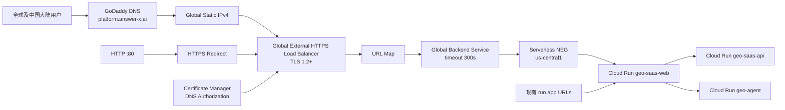

# SaaS 自定义域名平滑迁移设计

**日期：** 2026-07-13

**状态：** Approved for Planning

**目标域名：** `platform.answer-x.ai`

**验证域名：** `platform-canary.answer-x.ai`

**目标服务：** Cloud Run `geo-saas-web`（`us-central1`）

## 1. 背景与目标

当前 SaaS Web 由 Cloud Run 直接提供，用户访问的默认入口为：

- `https://geo-saas-web-414105678919.us-central1.run.app`
- `https://geo-saas-web-uj5wohdjgq-uc.a.run.app`

本次迁移为 SaaS 增加稳定、可控的品牌域名 `https://platform.answer-x.ai`，并满足以下要求：

1. 迁移期间 Cloud Run 默认 URL 始终可用。
2. 证书和负载均衡器在正式 DNS 切换前完成验证。
3. 正式切换失败时能够通过 DNS 回滚，并继续使用旧 URL。
4. 中国大陆用户在正式切换前完成真实网络验证。
5. 所有 GCP 资源纳入 Terraform，避免 Console 与代码漂移。
6. 第一阶段不引入 Cloud CDN、Cloud Armor、多地域 Cloud Run 或 Cloud SQL HA 改造。

## 2. 当前事实基线

- GCP Project：`project-90d7849c-de16-4c15-a0a`。
- 当前 CLI 与 ADC 账号：`lancelot.chen@answer-x.ai`。
- `geo-saas-web` 区域：`us-central1`。
- `geo-saas-web` ingress：`all`。
- 两个 Cloud Run 默认 URL 的 `/health` 当前均返回 HTTP 200。
- GCP 当前没有 global URL map、global backend service、global forwarding rule 或 Compute SSL certificate。
- Certificate Manager API 当前未启用。
- DNS 托管于 GoDaddy，权威 NS 为 `ns45.domaincontrol.com` / `ns46.domaincontrol.com`。
- `platform.answer-x.ai` 当前不存在公开 DNS 记录。
- SaaS Web 是 Vite 静态构建 + Nginx。浏览器默认使用同源 `/api` 与 `/api/agent`，Nginx 再代理到 SaaS API 和 Agent Cloud Run 服务。
- Cloud SQL 当前为单区域 ZONAL 实例；新增 global load balancer 不会把数据库自动变为高可用。

## 3. 方案比较与选型

### 3.1 方案 A：Global External Application Load Balancer（采用）

链路：

`用户 → Global HTTPS LB → Serverless NEG → geo-saas-web → SaaS API / Agent`

优点：

- GCP 官方支持 Cloud Run serverless NEG。
- 可使用全局静态 IP、Certificate Manager、HTTP→HTTPS 重定向。
- 可以先通过 DNS authorization 签发证书，再切正式 A 记录。
- 后续可选接入 Cloud Armor、Cloud CDN、多地域 Cloud Run。
- 资源可以完整纳入 Terraform。

代价：

- 当前美国区价格下，global forwarding rules 的基础费用约为 `$0.025/小时`，约 `$18.25/月`。
- 组件比 Cloud Run domain mapping 多，需要明确的变更和回滚流程。

### 3.2 方案 B：Cloud Run Domain Mapping（不采用）

优点是配置更少；缺点是能力和区域支持有限，官方仍把它描述为 preview/不建议生产使用的路径，也不提供负载均衡器统一入口能力。对商业 SaaS 不采用。

### 3.3 方案 C：第三方 CDN/反向代理（第一阶段不采用）

Cloudflare 等第三方可以提供更多边缘能力，但会增加另一套 DNS、证书、代理和故障域。当前目标只是稳定地绑定自有域名，先保持 GCP 原生链路。

## 4. 目标架构

核心语义：

- Load Balancer 是新增入口，不替换 `geo-saas-web`。
- 正式流量切换只发生在 `platform.answer-x.ai` 的 DNS A 记录开始指向全局静态 IP 时。
- `run.app` 默认 URL 在迁移和稳定期内继续直接指向同一个 Cloud Run 服务。
- 第一阶段只把 Web 放到 LB 后面。SaaS API 与 Agent 仍由 Web Nginx 通过当前 Cloud Run URL 访问，避免同时改变内部调用和认证边界。

## 5. GCP 资源设计

| 类型 | 建议名称 | 作用 |
|---|---|---|
| API | `compute.googleapis.com` | Load Balancer、IP、NEG |
| API | `certificatemanager.googleapis.com` | 托管证书、证书映射 |
| Global Address | `answerx-platform-ip` | `platform` 与 canary 共用的固定 IPv4 |
| Serverless NEG | `answerx-platform-web-neg` | 指向 `us-central1/geo-saas-web` |
| Backend Service | `answerx-platform-web-backend` | 全局外部托管后端，timeout 300 秒 |
| URL Map | `answerx-platform-url-map` | 全路径路由到 Web backend |
| HTTP Redirect URL Map | `answerx-platform-http-redirect-map` | HTTP 重定向到 HTTPS |
| SSL Policy | `answerx-platform-tls12` | 最低 TLS 1.2，MODERN profile |
| DNS Authorization | `answerx-platform-dns-auth` | `platform.answer-x.ai` 证书授权 |
| DNS Authorization | `answerx-platform-canary-dns-auth` | canary 证书授权 |
| Managed Certificate | `answerx-platform-cert` | 正式域名证书 |
| Managed Certificate | `answerx-platform-canary-cert` | canary 域名证书 |
| Certificate Map | `answerx-platform-cert-map` | HTTPS proxy 的证书入口 |
| Map Entry | `answerx-platform-cert-entry` | hostname → 正式证书 |
| Map Entry | `answerx-platform-canary-cert-entry` | hostname → canary 证书 |
| HTTPS Proxy | `answerx-platform-https-proxy` | URL map + cert map + SSL policy |
| HTTP Proxy | `answerx-platform-http-proxy` | HTTP redirect URL map |
| Forwarding Rule | `answerx-platform-https-fr` | Global IPv4:443 |
| Forwarding Rule | `answerx-platform-http-fr` | 同一 Global IPv4:80 |

Serverless NEG backend 不配置 health check；Google Cloud 对 serverless NEG 不支持传统 LB health check。应用存活验证继续使用 `/health`、Cloud Run 指标和外部探测。

## 6. 证书设计

采用 Certificate Manager 的 Google-managed certificate + DNS authorization，而不是 load balancer authorization：

- Terraform 创建 DNS authorization 后输出 Google 要求的 CNAME。
- 在 GoDaddy 添加该 CNAME，即可在正式 A 记录切换前完成证书签发。
- 每个域名单独使用 DNS authorization、certificate 和 certificate map entry，便于独立验证和清理。
- 证书达到 `ACTIVE` 才允许进入 canary 或正式 DNS 阶段。
- CNAME 在上线后长期保留，用于自动续期；删除 CNAME 会撤销后续签发/续期能力。

## 7. DNS 与流量切换设计

DNS 分三步：

1. 添加两条证书验证 CNAME，不承载用户流量。
2. 将 `platform-canary.answer-x.ai` 的 A 记录设为 Terraform 输出的 `platform_global_ip`，只用于验证。
3. 验证通过后将 `platform.answer-x.ai` 的 A 记录设为同一个 `platform_global_ip`，这一步才是正式切换。

正式记录 TTL 在切换前设为 300 秒。DNS 回滚通过删除或替换正式 A 记录完成，但递归 DNS 缓存意味着回滚不是瞬时的，最长可能受 TTL 和运营商缓存影响。

## 8. 身份认证、CORS 与代理约束

- 在现有 Google OAuth Web Client 中添加 Authorized JavaScript origins：
  - `https://platform-canary.answer-x.ai`
  - `https://platform.answer-x.ai`
- 不删除现有 `run.app` origin，保证旧 URL 登录仍可用。
- 在 `allowed_origins` 中追加 canary 和正式域名，不移除现有 origin。
- 不修改浏览器 API base；继续走同源 `/api` 与 `/api/agent`。
- 不修改 SaaS API 或 Agent 的 Cloud Run ingress。
- 不修改 `SAAS_API_URL` 和 Cloud Scheduler OIDC audience。
- 不禁用 SaaS API 或 Web 的 default URI。官方明确提示禁用默认 URL 会影响 Cloud Scheduler 等使用默认 URL 的服务。

## 9. Ingress 决策

阶段 1–5 保持 `geo-saas-web` ingress 为 `all`，这样旧 `run.app` URL 始终是有效回退入口。

稳定至少 7 天后再单独决策：

- **保留应急直连（当前推荐）：** 继续 `all`。好处是旧 URL 随时可用；代价是流量可以绕过 LB、Cloud Armor 或 CDN。
- **只允许 LB：** 改为 `internal-and-cloud-load-balancing`。安全边界更统一，但公网 `run.app` 不再是回退通道。

无论选哪种，都不设置 `default_uri_disabled=true`，除非以后先确认所有 Scheduler、监控和内部调用均已迁移。

## 10. 中国大陆访问策略

Global External Application Load Balancer 使用 Google 全球前端，但 GCP 没有中国大陆 Cloud Run region。它不会在配置层面要求用户必须使用 VPN，也不能保证大陆各运营商的可达性或时延。

因此正式切换前必须：

- 让 `platform-canary.answer-x.ai` 公开运行 48–72 小时。
- 至少覆盖中国电信、中国联通、中国移动的真实网络。
- 测试 DNS、TLS、登录、Dashboard、图表、Agent SSE、文章生成、上传和下载。
- 记录成功率、首屏耗时、SSE 中断和偶发 4xx/5xx。
- 若出现需要 VPN、持续超时或运营商级失败，停止正式 A 记录切换，另行评估中国加速/区域部署/合规方案。Cloud CDN 不能被当作必然解决大陆可达性的开关。

## 11. 高可用边界

本方案实现“域名切换零停机”和“入口可回滚”，但不是完整的多区域高可用：

- LB 只有一个 `us-central1` Serverless NEG backend。
- Cloud SQL 当前是 ZONAL。
- `geo-saas-web` max instances 当前为 2。

真正的基础设施 HA 应单独规划 regional Cloud SQL、第二 Cloud Run region、第二 serverless NEG、跨区域数据一致性与灾备演练，不能混入本次域名变更。

## 12. 成本边界

基于 2026-07-13 官方美国区价格：

- 当前项目没有 global forwarding rule。HTTP 与 HTTPS 两条规则仍落在项目 global forwarding rules 前 5 条的统一 `$0.025/小时` 档，约 `$18.25/月`。
- `us-central1` LB inbound/outbound data processing 均约 `$0.008/GiB`。
- 最近 30 天 `geo-saas-web` 日志约记录 0.068 GiB request、0.288 GiB response，按当前量级 LB data processing 约 `$0.003/月`，远低于固定规则费用。
- Internet data transfer out 另计，但当前量级很小。
- Serverless NEG 没有单独固定月费；Cloud Run 计算费用继续存在。
- 绑定 forwarding rule 的 global static IP 不另收闲置 IP 费。
- Certificate Manager 每项目最初 100 张证书免费；普通 RSA-2048/ECDSA 托管证书没有额外连接费。
- 第一阶段不启用 Cloud Armor、Cloud CDN，因而没有这两项费用。

## 13. 完成标准

只有同时满足以下条件才算完成：

1. Terraform plan 不替换或删除现有 Cloud Run 服务。
2. 两张托管证书均为 `ACTIVE`。
3. canary 在全球和中国大陆真实网络完成 48–72 小时验证。
4. `platform.answer-x.ai` HTTPS、HTTP 重定向、OAuth、SPA deep link、API 和 Agent SSE 均通过。
5. 切换后旧 `run.app` URL 仍返回 200。
6. 2 小时、24 小时、72 小时观察窗口没有迁移引入的错误率或延迟回归。
7. GoDaddy DNS、OAuth origin、GCP Terraform state 与运行资源有完整记录。
8. 未改动 SaaS API/Agent ingress、Scheduler audience、Cloud SQL 或产品数据库。

## 14. 官方依据

- [Global External Application Load Balancer + Cloud Run serverless NEG](https://docs.cloud.google.com/load-balancing/docs/https/setup-global-ext-https-serverless)
- [Certificate Manager DNS authorization](https://docs.cloud.google.com/certificate-manager/docs/domain-authorization)
- [部署 DNS 授权的全局托管证书](https://docs.cloud.google.com/certificate-manager/docs/deploy-google-managed-dns-auth)
- [Cloud Run ingress 与默认 URL](https://docs.cloud.google.com/run/docs/securing/ingress)
- [Cloud Load Balancing 定价](https://cloud.google.com/load-balancing/pricing)
- [Certificate Manager 定价](https://cloud.google.com/certificate-manager/pricing)
- [Google Identity Web Client origin 配置](https://developers.google.com/identity/gsi/web/guides/get-google-api-clientid)
