# GEO 功能权限、Workspace Entitlement、RBAC 与 User Audit 验证报告

验证日期：2026-07-26  
验证账号：`gotyechen@gmail.com`  
验证范围：Migration 134、Admin UI、SaaS UI、Workspace 套餐、四种角色、跨租户隔离、User Audit

## 1. 结论摘要

本轮核心功能已经按设计生效：

- AnswerX 配置为 `Analytics`，AnswerX (Demo) 保持 `Full Platform`。
- Analytics 套餐已经包含 Configuration。
- Admin 可以编辑 Configuration，Viewer 可以只读浏览 Configuration。
- Viewer 在 Full Platform 中可以查看已有内容，但没有新建内容任务入口。
- Workspace 未购买功能和角色无权限使用不同的解锁提示。
- `account_manager` 与 `super_admin` 可以绕过 Workspace 套餐限制。
- 所有角色看到相同的 Sidebar，未授权功能没有被物理隐藏。
- 新的 Workspace Context 接口和已有事实数据接口都能阻断未授权 Workspace 请求。
- Admin API 操作和 SaaS 页面访问均能进入 User Audit。
- 测试完成后，`gotyechen@gmail.com` 已恢复为原始 `super_admin + support_all_clients=true`，测试期间创建的临时 Workspace 授权已全部删除。

本轮发现两个建议优先修复的 Admin UI 问题：

1. Feature Access 使用完整 `/api/clients` 加载 Workspace 选择列表，初始化偏慢。
2. 切换 Workspace 后，套餐和 Feature 开关会短暂显示上一个 Workspace 的状态，存在误读和误保存风险。

## 2. 实际运行拓扑

本报告中的“日常本地环境”使用独立服务和独立端口：

| 模块 | Web 入口 | 后端入口 |
|---|---|---|
| Admin | `http://127.0.0.1:6173` | `http://127.0.0.1:8000` |
| SaaS | `http://127.0.0.1:6174` | `http://127.0.0.1:9101` |
| Agent | SaaS 中的 Anthony 页面 | `http://127.0.0.1:9102` |

三个 Web/API 服务已分别验证：

- Admin Web：HTTP 200
- Admin API `/health`：HTTP 200
- SaaS Web：HTTP 200
- SaaS API `/health`：HTTP 200
- Agent API `/health`：启动完成并监听 9102

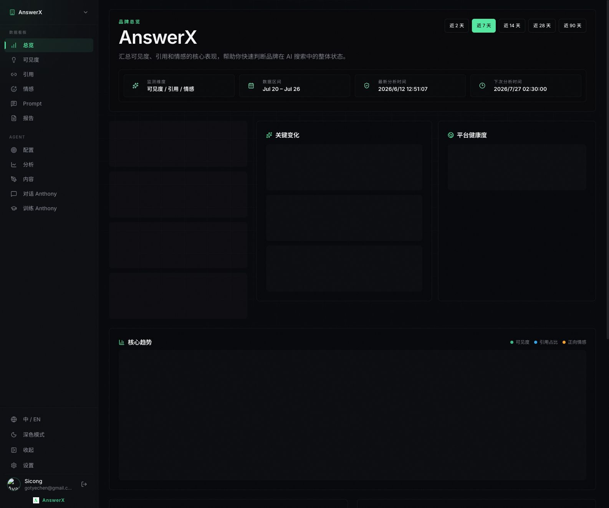

## 3. Migration 134 核验

数据库核验结果：

- `geo_client_user_access.role` 已支持：
  - `admin`
  - `viewer`
  - `account_manager`
- Analytics 套餐已经包含 `actions.configuration`。
- `account_manager` 没有被自动授予任何 Workspace，Migration 没有扩大 Workspace membership。

验证前账号基线：

- User ID：`77246f8b-84b8-4e3b-a085-7a79b7a1e825`
- Admin Role：`super_admin`
- `support_all_clients=true`
- AnswerX、AnswerX (Demo) 均无显式 Workspace grant

验证结束后的状态与基线一致，临时 grant 数量为 0。

## 4. Admin UI 权限配置入口

Admin UI 中目前有以下入口：

### 4.1 Feature Access → Workspace Grants

用于选择 Workspace，并绑定：

- Analytics
- Full Platform
- Custom

AnswerX 已配置为 Analytics：

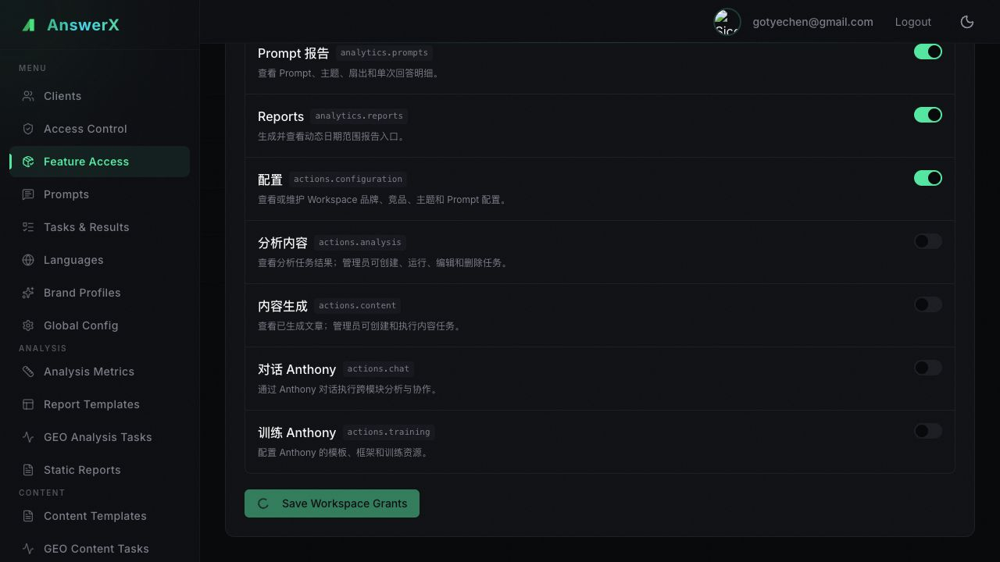

AnswerX (Demo) 已配置为 Full Platform：

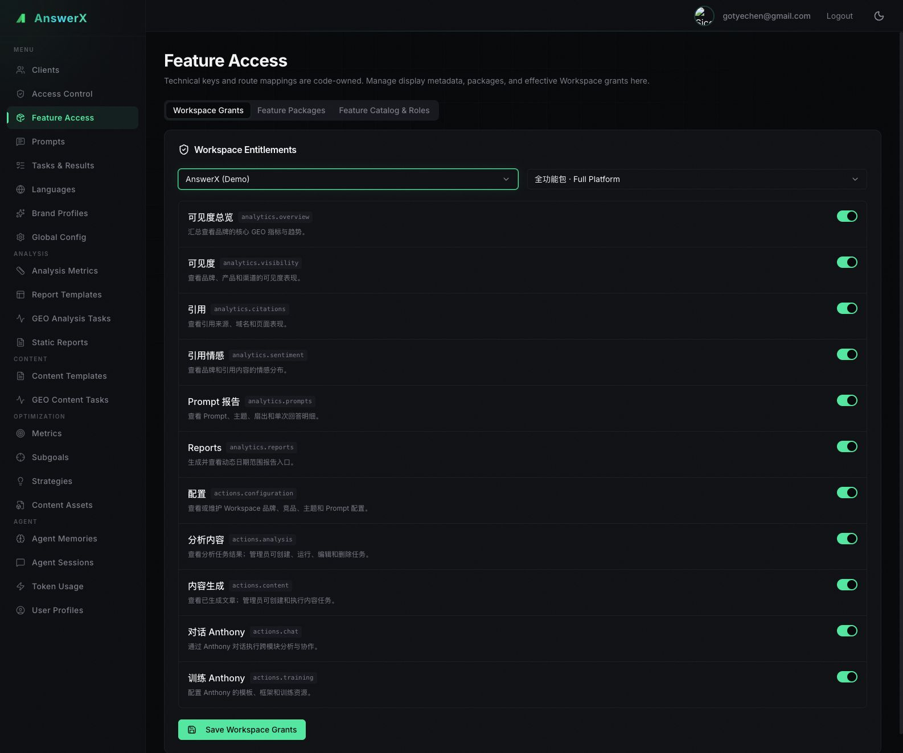

### 4.2 Feature Access → Feature Packages

用于维护套餐与功能点的组成关系。

Analytics 当前包含：

- `analytics.overview`
- `analytics.visibility`
- `analytics.citations`
- `analytics.sentiment`
- `analytics.prompts`
- `analytics.reports`
- `actions.configuration`

其中 Configuration 是标准套餐必选项，在 UI 中显示为 `Required`，不能从标准套餐中误删。

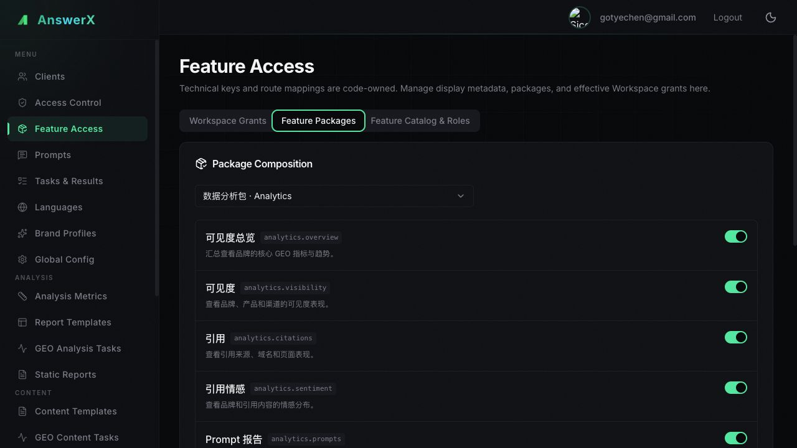

### 4.3 Feature Access → Feature Catalog & Roles

用于查看和编辑：

- 功能展示名称
- 中英文功能介绍
- 功能排序
- 功能启用状态
- 各角色在每个功能点上的 `view / execute / manage` 能力

技术 Feature Key、路由和鉴权关系仍由仓库中的单一权限注册表维护；数据库维护展示元数据、套餐和 Workspace 实际授权。

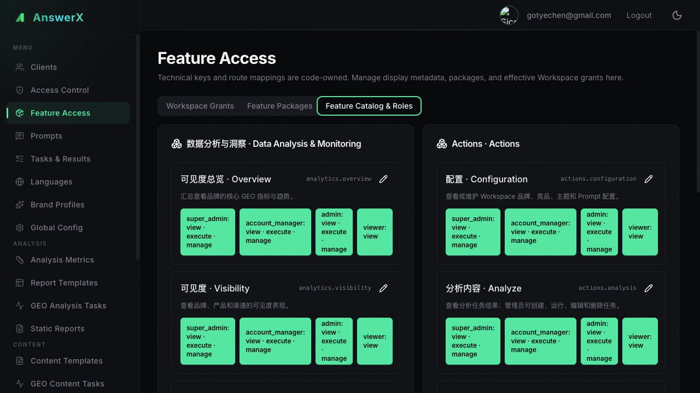

### 4.4 Access Control

当前包含：

- Users：用户基础信息
- Client Access：Workspace membership 与 `admin / viewer / account_manager`
- Super Admin：Admin 系统角色与 `support_all_clients`
- User Audit：API 操作与 SaaS 页面访问记录

## 5. SaaS 四角色验证

### 5.1 Viewer

#### AnswerX / Analytics

验证结果：

- 数据分析页面可以访问。
- Sidebar 仍然显示完整功能结构。
- Configuration 可以进入并查看。
- Configuration 页面显示只读提示，新增、删除、Tab 切换和 AI 建议等修改操作被禁用。
- 内容生成因 Workspace 未购买而显示套餐解锁提示。

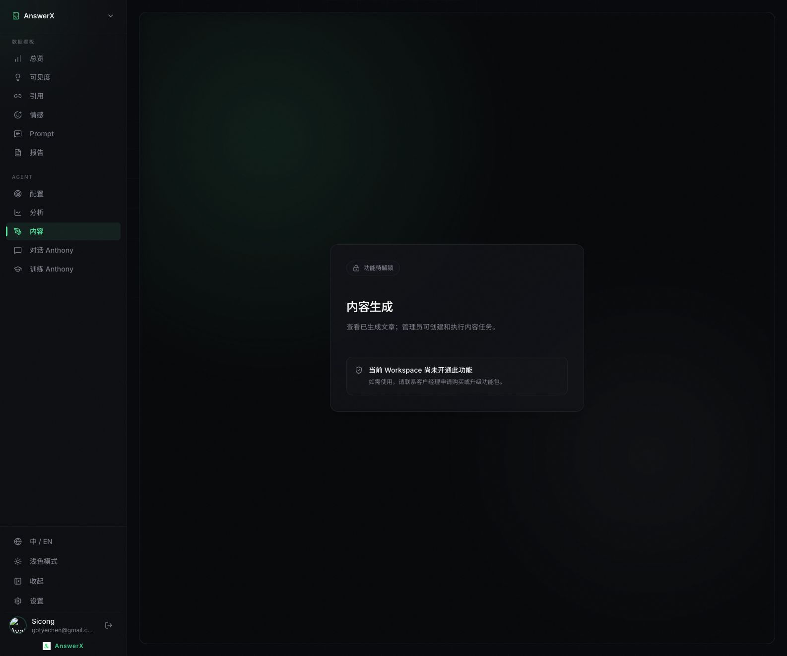

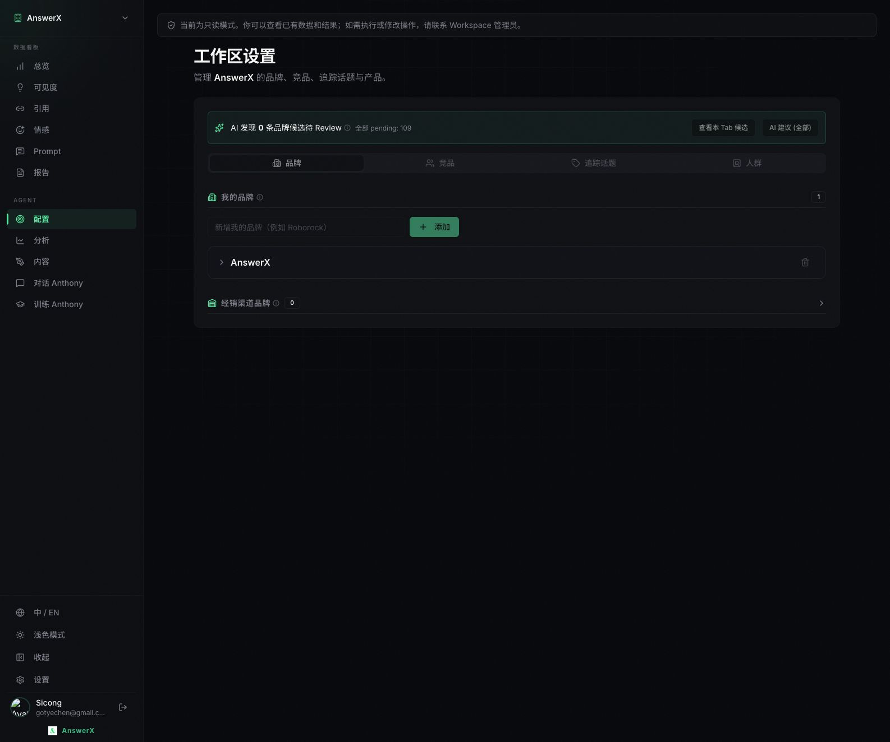

#### AnswerX (Demo) / Full Platform

验证结果：

- 可以查看已有内容任务和文章结果。
- 页面没有“新建任务”入口。
- Anthony Chat 因 Viewer 角色没有权限而显示联系 Workspace 管理员的提示。

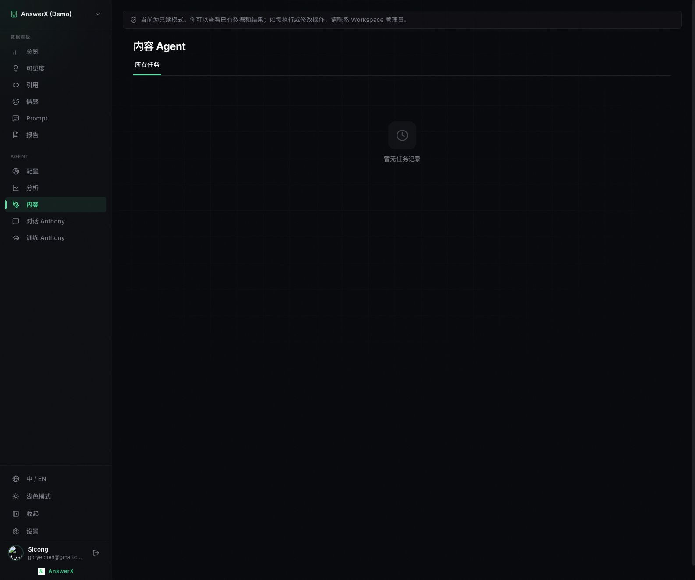

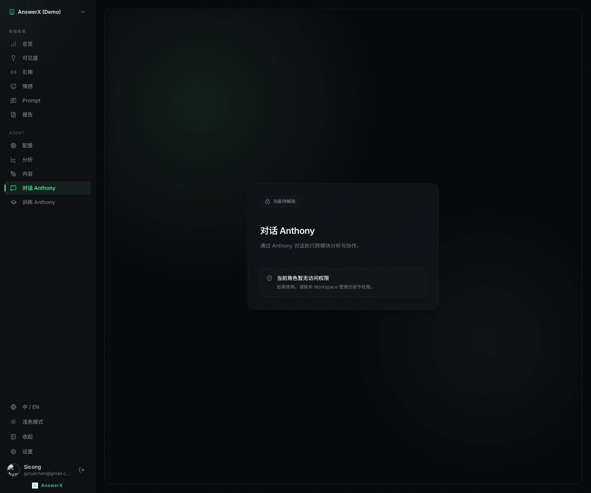

### 5.2 Admin

#### AnswerX / Analytics

验证结果：

- Configuration 可编辑。
- 品牌新增输入框、添加按钮、Tab 和 AI 建议入口恢复可操作。
- 内容生成仍受 Workspace 套餐限制，Admin 不会绕过套餐。

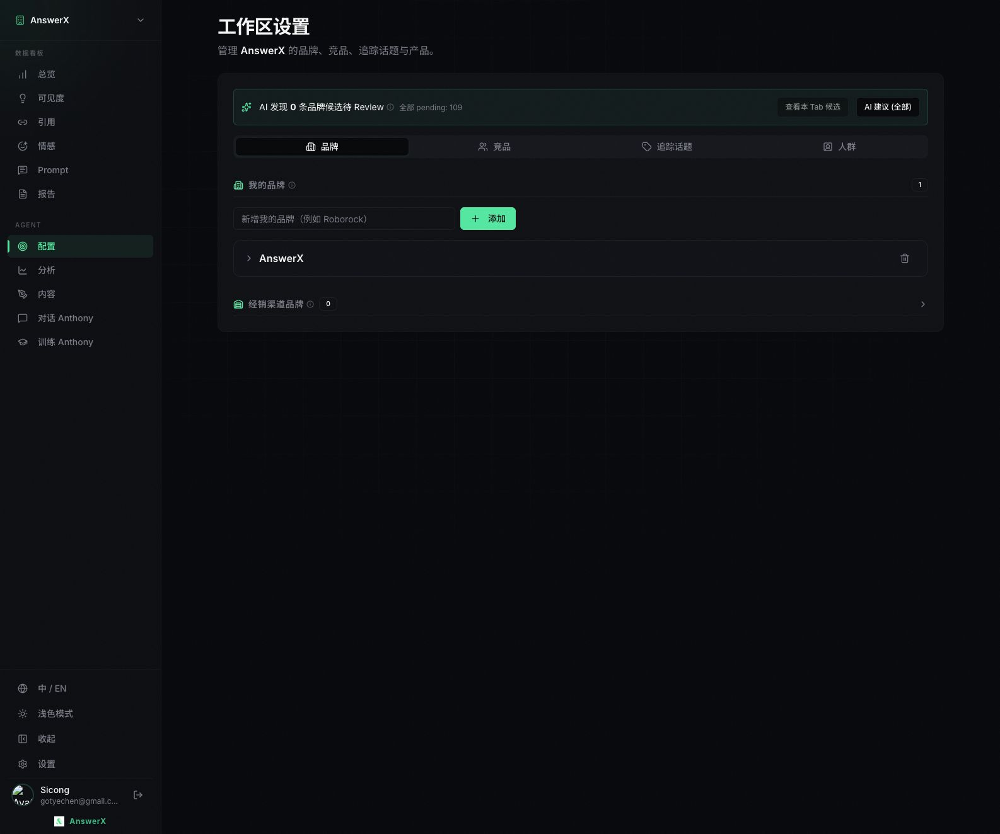

#### AnswerX (Demo) / Full Platform

验证结果：

- 内容 Agent 可进入。
- “新建任务”入口可见。
- Admin 具有 Full Platform 中的执行和管理能力。

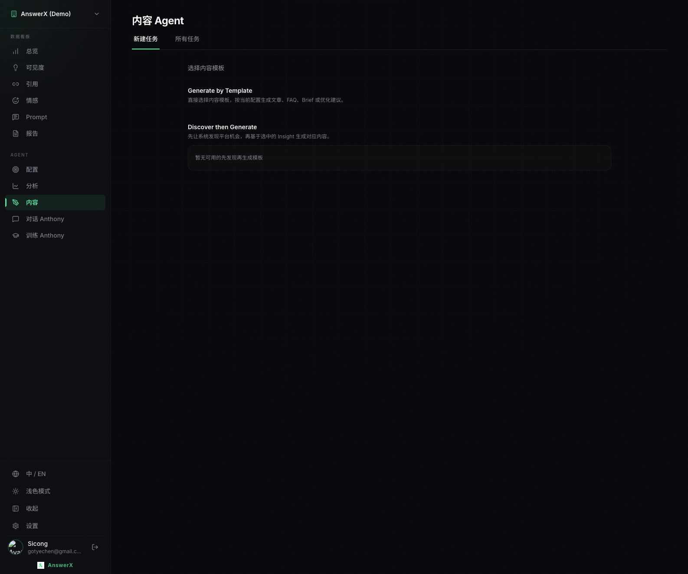

### 5.3 Account Manager

在 AnswerX 仅购买 Analytics 的情况下：

- 内容 Agent 仍可进入。
- “新建任务”入口可见。
- 证明 `account_manager` 已绕过 Workspace 套餐限制。

### 5.4 Super Admin

在 AnswerX 仅购买 Analytics 的情况下：

- 内容 Agent 仍可进入。
- “新建任务”入口可见。
- `support_all_clients=true` 时不需要显式 Workspace grant。
- 测试结束后已经恢复此角色和状态。

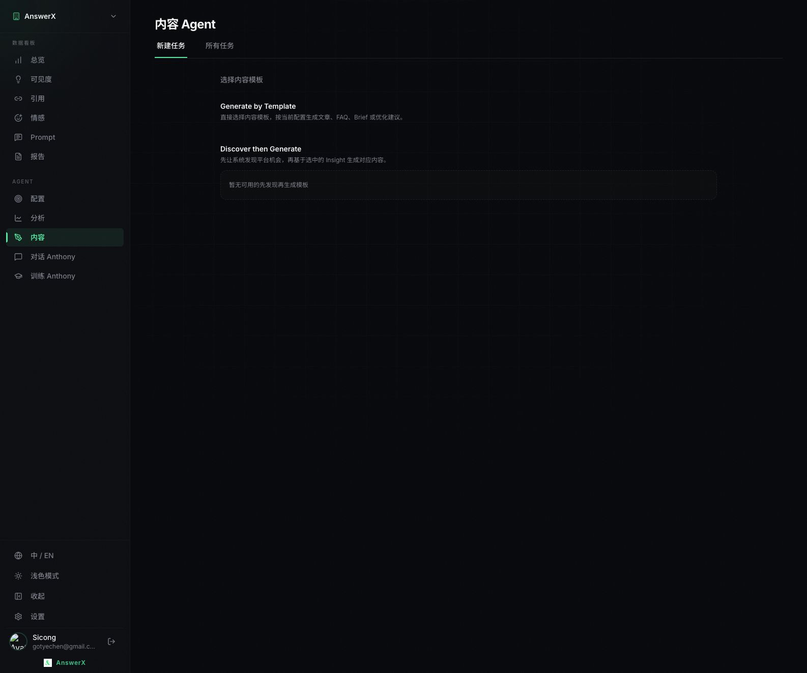

## 6. 权限结果矩阵

### 6.1 Analytics Workspace

| 角色 | Analytics 页面 | Configuration | Analysis / Content / Chat / Training |
|---|---|---|---|
| Viewer | 可查看 | 只读 | Workspace 未购买提示 |
| Admin | 可查看与管理 | 可编辑 | Workspace 未购买提示 |
| Account Manager | 完整权限 | 可编辑 | 绕过套餐，完整权限 |
| Super Admin | 完整权限 | 可编辑 | 绕过套餐，完整权限 |

### 6.2 Full Platform Workspace

| 角色 | Analytics 页面 | Configuration | Analysis | Content | Chat / Training |
|---|---|---|---|---|---|
| Viewer | 可查看 | 只读 | 可查看已有结果 | 可查看已有结果 | 角色无权限提示 |
| Admin | 完整权限 | 可编辑 | 可创建和管理 | 可创建和管理 | 完整权限 |
| Account Manager | 完整权限 | 可编辑 | 完整权限 | 完整权限 | 完整权限 |
| Super Admin | 完整权限 | 可编辑 | 完整权限 | 完整权限 | 完整权限 |

## 7. 跨租户隔离验证

为了验证新接口不会泄露未授权 Workspace 数据，测试期间短暂将账号设置为：

- 仅有 AnswerX 的 Viewer grant
- 无 AnswerX (Demo) grant
- 无 `support_all_clients`

请求结果：

| 请求 | 结果 |
|---|---|
| `GET /api/workspaces/{AnswerX}/context` | HTTP 200 |
| `GET /api/workspaces/{AnswerX Demo}/context` | HTTP 403 `No access to this client` |
| `GET /api/insights/overview/status?client_id={AnswerX Demo}` | HTTP 403 `No access to this client` |

结论：

- Metadata Context 被 Workspace 鉴权保护。
- 真实分析事实接口也被 Workspace 鉴权保护。
- 未授权用户不能通过新的轻量接口或已有事实接口读取其他 Workspace 数据。

测试后已立即恢复 Super Admin 状态并删除临时 grant。

## 8. User Audit 验证

User Audit 能正确显示本轮产生的记录，包括：

- AnswerX / AnswerX (Demo)
- `/overview`
- `/agents/tracking`
- `/agents/content`
- `/agents/chat`
- Page View
- Admin Feature Access PUT 操作
- HTTP 状态

本次验证时列表共有约 19,400 条事件，最新页面访问可以在几秒内进入列表。

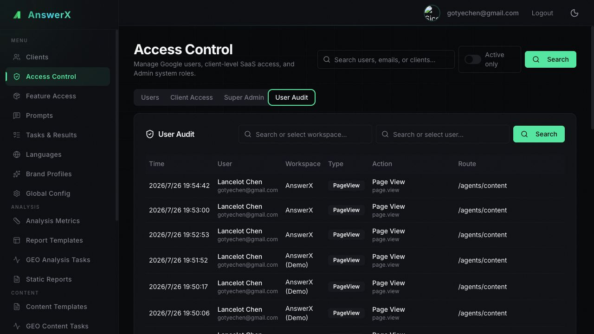

说明：

- Browser 和 Admin API 产生的业务操作能够进入 User Audit。
- 为避免自降级后无法恢复，本轮四角色切换通过精确数据库 DML 完成。这些直接数据库维护操作不会经过 HTTP 审计中间件，因此不会进入 User Audit；本报告保留了完整操作顺序和恢复结果。
- Audit 写入仍采用可丢失、非阻塞的运营级策略，不会阻断主业务 API。

## 9. 代码 Review 与自动化测试

实现层面确认：

- 技术权限目录集中在仓库权限注册表。
- SaaS、Agent 和 Admin API 使用统一的 Workspace access 解析。
- `account_manager` 和 `super_admin` 的 entitlement override 由统一逻辑计算。
- Metadata 和解锁页文案来自数据库 Feature Catalog。
- `/api/me/workspaces` 只返回轻量 Workspace 权限启动信息。
- Workspace 详情通过 `/api/workspaces/{client_id}/context` 按需加载。
- `/api/clients` 已从逐 Workspace 查询收敛为批量查询。
- User Audit 已由统一中间件和事件接口承载。

此前完成的自动化结果：

| 测试集 | 结果 |
|---|---|
| geo_common | 130 passed |
| geo_admin backend | 99 passed |
| geo_saas backend | 497 passed |
| geo_agent | 193 passed |
| geo_saas web | 26 passed |
| geo_admin web | 13 passed |
| geo_saas web build | passed |
| geo_admin web build | passed |

## 10. 发现的问题与优化建议

### P1：Feature Access 不应使用完整 `/api/clients` 初始化 Workspace 下拉框

实测完整 `/api/clients`：

- 响应约 119 KB
- 通过本地 Cloud SQL Proxy 时约 12 秒
- 包含 peers、domains、topics、personas 等 Feature Access 不需要的数据

虽然 N+1 已被批量查询替代，但 Feature Access 只需要 `id + name`。建议：

1. 新增 Admin 专用轻量 Workspace summary 接口，或为 `/api/clients` 增加明确的 summary 模式。
2. Feature Access 和 Access Control 的 Workspace 选择器统一使用轻量接口。
3. 选择具体 Workspace 后再加载 entitlement 或完整 Client detail。

### P1：Workspace 切换存在旧 entitlement 短暂残留

实测：

- 从 AnswerX 切换到 AnswerX (Demo) 后，界面短暂显示 AnswerX 的 Analytics 状态，随后才更新为 Full Platform。
- 页面初次加载时也会短暂显示默认 Full Platform 和空开关，随后才更新为真实 Analytics。

风险：

- 操作人员可能误以为当前 Workspace 配置错误。
- 网络较慢时，操作人员可能在真实 entitlement 返回前点击保存。

建议：

1. `selectedClientId` 改变后立即进入 entitlement loading 状态。
2. 加载完成前禁用套餐选择、Feature Switch 和 Save。
3. 显示当前 Workspace 专属 Skeleton。
4. 使用 request sequence 或 AbortController，避免较早请求覆盖较晚 Workspace。

### P2：本地 Cloud SQL Proxy 的长连接稳定性

验证期间曾出现 `connection reset by peer` 和 asyncpg 连接中断。切换到稳定代理并重启 API 后恢复。

该问题更接近本地验证环境稳定性，不是本轮 RBAC 逻辑缺陷。建议本地 E2E runbook 增加：

- Proxy health 检查
- API 启动后的数据库连接检查
- 失败时重建 pool/重启服务的标准步骤

## 11. 最终状态

- AnswerX：Analytics
- AnswerX (Demo)：Full Platform
- `gotyechen@gmail.com`：Super Admin
- `support_all_clients=true`
- 测试临时 Workspace grants：0
- Admin、SaaS、Agent 独立端口运行
- 未执行任何新增 DDL

