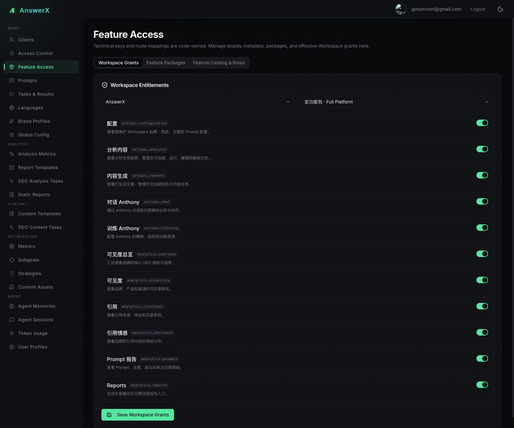
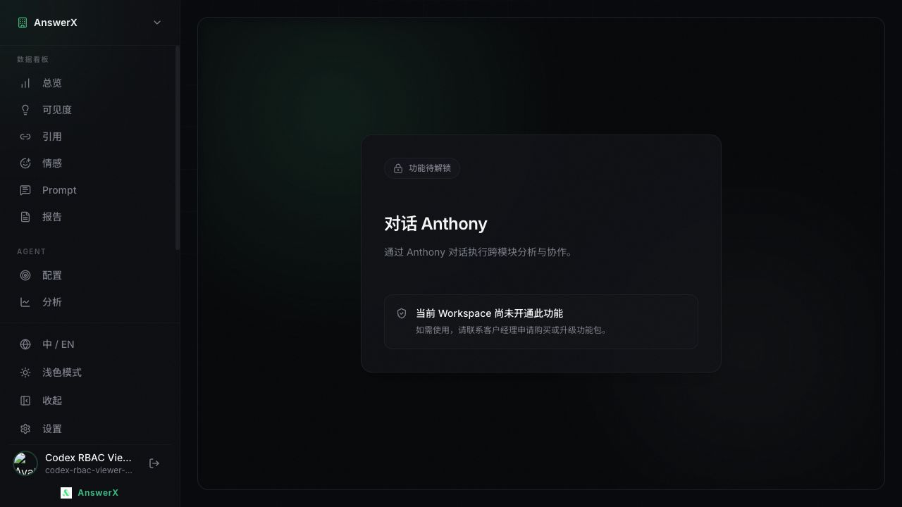
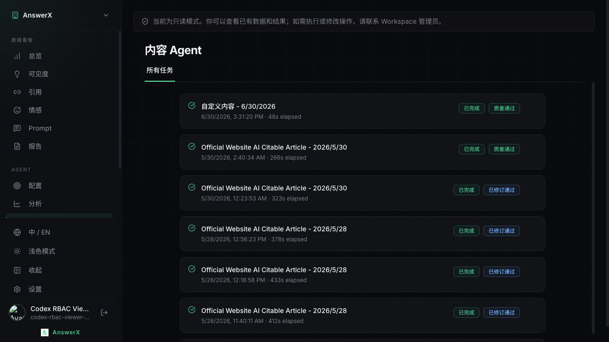
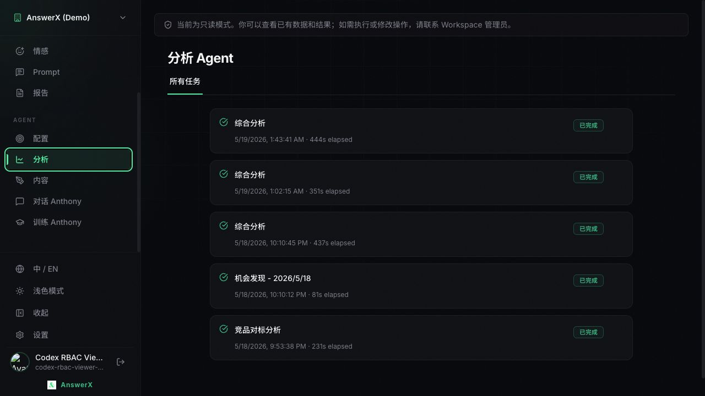
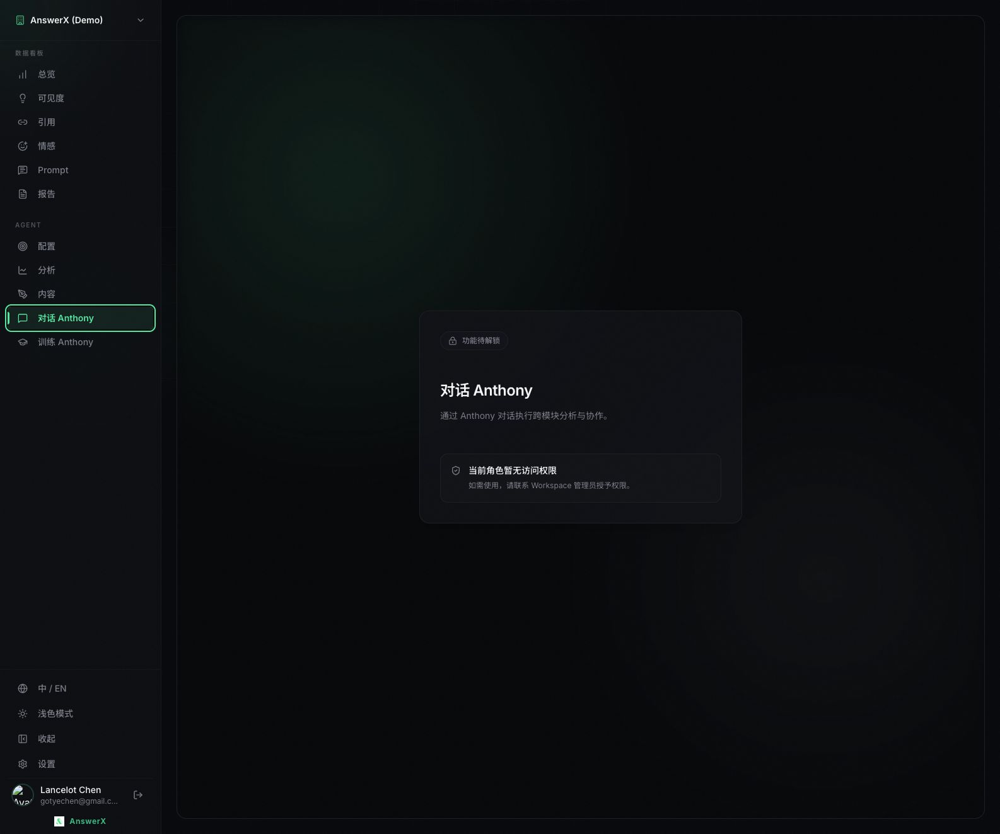
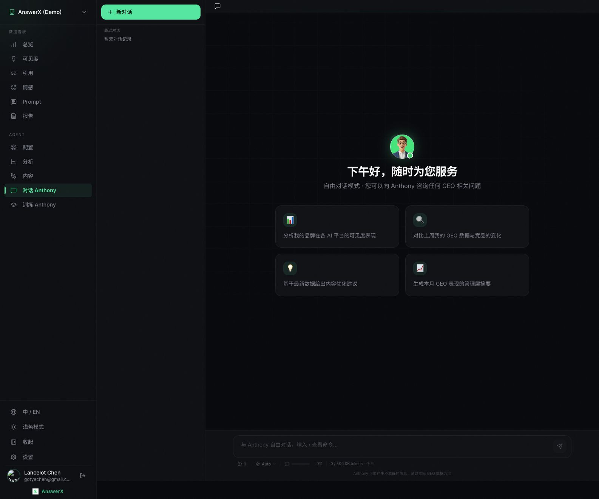
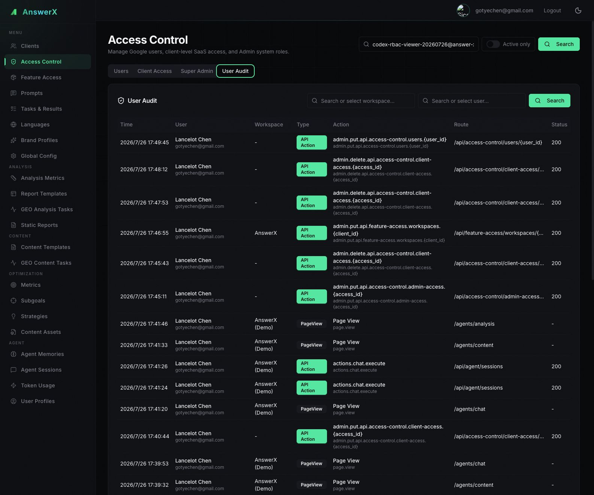
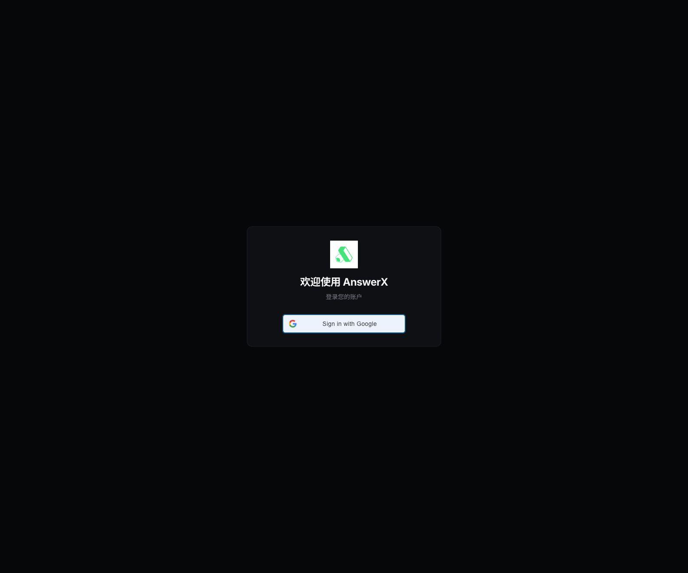

# RBAC、Workspace 功能授权与 User Audit 验证报告

日期：2026-07-26  
范围：Migration 133 后的 Admin UI、SaaS UI、SaaS API、Agent API、User Audit，以及 Cloud Run 日常环境可达性

## 1. 结论

本地环境的核心验收场景已经通过：

- Sidebar 对 Admin 和 Viewer 保持一致，不隐藏未授权功能。
- 权限按“Workspace 是否开通”与“角色是否允许”两层依次判断。
- Viewer 可以查看数据分析、已有分析结果、已有生成文章、配置和报告，但不能修改配置，也不能创建、执行、编辑或删除分析/内容任务。
- Viewer 不能访问“对话 Anthony”和“训练 Anthony”；页面分别能正确展示 Workspace 未购买或角色无权限的弱提示。
- Viewer 在当日报告不存在时可以执行轻量 materialize 并查看，接口返回 200。
- User Audit 已集中到服务端拦截器和异步批量写入队列；审计失败或队列满不会阻塞业务请求。
- 新建测试 Viewer 和个人账号 Viewer/Admin 切换均已验证，所有临时授权已经清理。

日常 Cloud Run 环境的服务和登录页均可访问，但当前运行 Revision 早于本次 2026-07-26 改造，因此本次 RBAC 代码尚未部署到该环境。日常环境的登录态 RBAC 验收应放在部署之后执行。

## 2. 当前权限模型

最终访问结果为：

```text
Workspace 功能授权
    └─ 未开通：展示“联系客户经理申请购买或升级”
    └─ 已开通：继续判断 Workspace 角色
                  └─ 角色无权限：展示“联系 Workspace 管理员授予权限”
                  └─ 角色有权限：按 view / execute / manage 呈现
```

当前最小角色差异如下：

| 功能点 | Admin | Viewer |
| --- | --- | --- |
| 可见度总览、可见度、引用、情感、Prompt、Reports | view / execute / manage | view |
| 配置 | view / execute / manage | view，页面控件禁用 |
| 分析内容 | view / execute / manage | 查看已有任务和报告 |
| 内容生成 | view / execute / manage | 查看已有任务和文章 |
| 对话 Anthony | view / execute / manage | 无访问权限 |
| 训练 Anthony | view / execute / manage | 无访问权限 |

角色能力矩阵目前由代码注册表控制，Admin UI 只读展示，不允许在数据库中任意改变技术能力。这符合本轮已确认的“先保持最小 RBAC，未来再扩展”的边界。

## 3. Admin UI 入口梳理

### Feature Access

导航入口：`Feature Access`

| Tab | 用途 |
| --- | --- |
| Workspace Grants | 选择 Workspace，套用预设功能包或逐项切换功能授权 |
| Feature Packages | 查看和编辑现有功能包的功能点组成 |
| Feature Catalog & Roles | 查看一、二级功能目录、技术 Key、展示元数据和 Admin/Viewer 的 view / execute / manage 能力 |

新建 Workspace 时，`Clients` 页面中的 `Feature Package` 字段也可以选择预设包或 Custom 明细。默认使用 `full_platform`。




### Access Control

导航入口：`Access Control`

| Tab | 用途 |
| --- | --- |
| Users | 注册用户、启用/停用状态 |
| Client Access | 用户与 Workspace 的 Admin/Viewer 角色绑定 |
| Super Admin | Admin UI 超级管理员以及 `support_all_clients` 支持人员全 Workspace 访问 |
| User Audit | 查询页面访问、API 操作、状态码、功能 Key、Workspace 和脱敏参数 |

因此：

- Workspace 买了哪些功能：看 `Feature Access → Workspace Grants`。
- 预设包包含哪些功能：看 `Feature Access → Feature Packages`。
- Admin/Viewer 理论上具有什么能力：看 `Feature Access → Feature Catalog & Roles`。
- 某个用户在某 Workspace 是 Admin 还是 Viewer：看 `Access Control → Client Access`。
- 内部支持人员是否绕过逐 Workspace Grant：看 `Access Control → Super Admin`。

## 4. 本地浏览器验证

### Workspace 功能授权

测试期间将 `AnswerX` 临时切换为 Analytics 包，`AnswerX (Demo)` 保持 Full Platform：

- AnswerX Viewer 打开 Chat：展示“当前 Workspace 尚未开通此功能”。
- AnswerX (Demo) Viewer 打开 Chat：展示“当前角色暂无访问权限”。
- 两种锁定原因和提示语符合设计。




### Viewer

新建测试用户 `codex-rbac-viewer-20260726@answer-x.ai`，分别授予 AnswerX 和 AnswerX (Demo) Viewer：

| 场景 | 结果 |
| --- | --- |
| Sidebar | 所有菜单保持可见 |
| Overview / Visibility / Citation / Sentiment / Prompt | 可查看，显示只读提示 |
| Configuration | 可查看，表单整体禁用 |
| Analysis | 可查看已有任务；不显示“新建任务” |
| Content | 可查看已有文章；不显示“新建任务” |
| Chat / Training | 角色锁定 |
| 当日报告不存在时 materialize | 200，可生成并查看 |
| 创建分析任务 | 403 `actions.analysis.execute` |
| 创建内容任务 | 403 `actions.content.execute` |
| 发起 Chat | 403 `actions.chat.execute` |
| 修改配置 | 403 `actions.configuration.manage` |





### 个人账号 Viewer/Admin 切换

对 `gotyechen@gmail.com` 做了以下临时操作：

1. 增加 AnswerX (Demo) Viewer Grant。
2. 临时关闭 `support_all_clients`，确认个人账号呈现 Viewer 只读和 Chat 角色锁定。
3. 将 Grant 改为 Admin，确认 Analysis/Content 出现“新建任务”，Chat 可访问。
4. 恢复 `support_all_clients=true`。
5. 删除临时 Workspace Grant。





## 5. User Audit 验证

Admin UI 的 User Audit 能看到：

- Viewer 页面访问；
- Reports materialize 200；
- Viewer 写操作被拒绝的 403；
- Admin 权限与 Workspace 功能包变更；
- 路由模板、方法、状态码、用户、Workspace、目标 ID 和脱敏查询参数。

服务端实现使用有界内存队列、`put_nowait`、批量 `executemany` 和短周期 flush。队列满或数据库写入失败时丢弃审计并记录计数，不等待、不回滚业务请求。`prompt`、`message`、`content`、`query`、`token`、`secret`、`password` 等参数会被替换为 `[REDACTED]`。Cloud Scheduler/System Job 身份不记录为用户行为。



## 6. 代码 Review：本轮已修复

### P0：权限加载期间短暂显示真实页面

原逻辑在 Workspace 列表仍在加载时直接渲染子页面。Cloud SQL 代理较慢时，Chat、Training 等未授权页面会先出现，随后才切换为锁定页。

已改为：

- 受保护路由先展示“正在确认 Workspace 功能权限”；
- 没有可访问 Workspace 时展示独立空状态；
- 权限确认前不挂载真实页面，不触发其数据请求。


### P1：Agent 模板类接口没有按显式 Task Type 收敛

前端实际请求使用 `type=content_generation` 或 `type=analysis`。原逻辑将 templates、workflow-config 等静态子路径直接作为多功能共享资源处理，可能让只购买 Analysis 的 Workspace 读取 Content 模板。

已支持 `task_type` 和 `type` 两种参数，并把显式 Task Type 收敛到 `actions.analysis` 或 `actions.content`。

### P1：被拒绝的 Agent 审计记录为 `unknown.execute`

原逻辑只有授权成功后才写入 `request.state.feature_key`。403 发生时拦截器拿不到功能 Key。

已在抛出 Workspace 锁定或角色拒绝前设置准确的功能 Key、能力和 Audit Policy。历史记录不会回写；新请求在部署新代码后生效。

### P2：Admin 角色矩阵展示信息不足

原界面只显示 Admin/Viewer 是否包含 `view`，无法看出 execute/manage 差异；功能列表还按模块 Key 字母顺序把 Actions 放在 Analytics 前面。

已改为完整展示 `view · execute · manage`，没有权限时显示 `none`，并固定按“数据分析与洞察 → Actions”排序。

## 7. 仍建议调整

### P1：`GET /api/clients` 存在明显 N+1 查询

当前实现依次遍历 Workspace，再逐 Workspace 查询权限和 Topics，并逐 Topic 查询产品。内部支持账号能访问全部 Workspace 时，权限初始化会出现明显等待。

建议下一轮二选一：

1. 新增轻量 `/api/me/workspaces`，只返回 Workspace、角色、功能授权和能力；Topic/Product 在具体页面懒加载。
2. 将当前权限、Topic、Product 查询改为少量 set-based SQL，再在内存中组装。

本轮已经用加载保护消除了权限闪现，但没有扩大修改面去重构该接口。

### P2：展示元数据存在两个来源

Admin UI 可以编辑数据库中的功能名称和介绍，但 SaaS 解锁页仍读取代码生成的静态注册表。修改 Admin 元数据后，SaaS 文案不会同步变化。

建议保留技术 Key、路由、角色能力在代码中，同时提供一个可缓存的只读 Feature Catalog API，让 SaaS 只读取数据库中的展示名称和介绍。

### P2：Feature Package 只能编辑现有包

Admin API 支持保存 Package，但 UI 目前只能编辑已有的 Analytics 和 Full Platform，没有“新建/复制功能包”入口。当前两个预设足够本轮使用；如果后续需要按客户复用更多销售套餐，应补充 Create/Duplicate UI。

### P3：前端 Bundle 偏大

构建通过，但 SaaS 主 Bundle 约 2.43 MB、Admin 主 Bundle 约 1.52 MB（压缩前），Vite 给出 chunk size 警告。与权限正确性无关，可在后续按页面做 lazy loading。

## 8. 日常 Cloud Run 环境

2026-07-26 检查结果：

| 服务 | Revision | 镜像 | 状态 |
| --- | --- | --- | --- |
| SaaS Web | `geo-saas-web-00067-j95` | `v99` | Web 200 |
| SaaS API | `geo-saas-api-00053-wjg` | `v73` | `/health` 200 |
| Agent API | `geo-agent-api-00035-wqn` | `v53` | `/health` 200 |
| Admin Web | `geo-admin-web-00026-4js` | `v31` | Web 200 |
| Admin API | `geo-admin-api-00031-km5` | `v30` | Ready |

Revision 创建时间分别为 2026-07-22、2026-07-22、2026-06-05、2026-07-15 和 2026-07-15，均早于本轮 2026-07-26 改造。因此可以确认服务健康和登录页可达，但不能把日常环境视为已部署本轮 RBAC。

此外，自动化浏览器没有可复用的 Google 登录会话，Google 登录弹窗无法在该浏览器内完成。因此即使部署后，仍需先完成一次日常环境登录，才能继续做登录态对比。



## 9. 数据恢复与清理

最终数据库状态：

| 对象 | 最终状态 |
| --- | --- |
| AnswerX | `full_platform`，11 个功能点 |
| AnswerX (Demo) | `full_platform`，11 个功能点 |
| `gotyechen@gmail.com` | active；super_admin；support_all_clients=true；0 个临时 Workspace Grant |
| 测试 Viewer | inactive；0 个 Workspace Grant |

测试账号记录保留为 inactive，便于审计追踪，不再拥有任何客户数据访问权。

## 10. 自动化与构建结果

- 44 个权限、鉴权、Access Control、Audit 和前端契约测试通过。
- Feature Registry 生成物一致性检查通过。
- SaaS Web TypeScript + Vite build 通过。
- Admin Web test、typecheck、Vite build 通过。
- 浏览器回归确认权限加载页先出现，随后正常进入授权页面。

## 11. 截图索引

除正文截图外，本轮还保留：

- [Viewer Overview 只读](../verification-assets/rbac-2026-07-26/03-saas-viewer-overview-readonly.png)
- [AnswerX 临时 Analytics Package](../verification-assets/rbac-2026-07-26/05-admin-answerx-analytics-package.png)
- [全部 13 张验证截图目录](../verification-assets/rbac-2026-07-26/)
